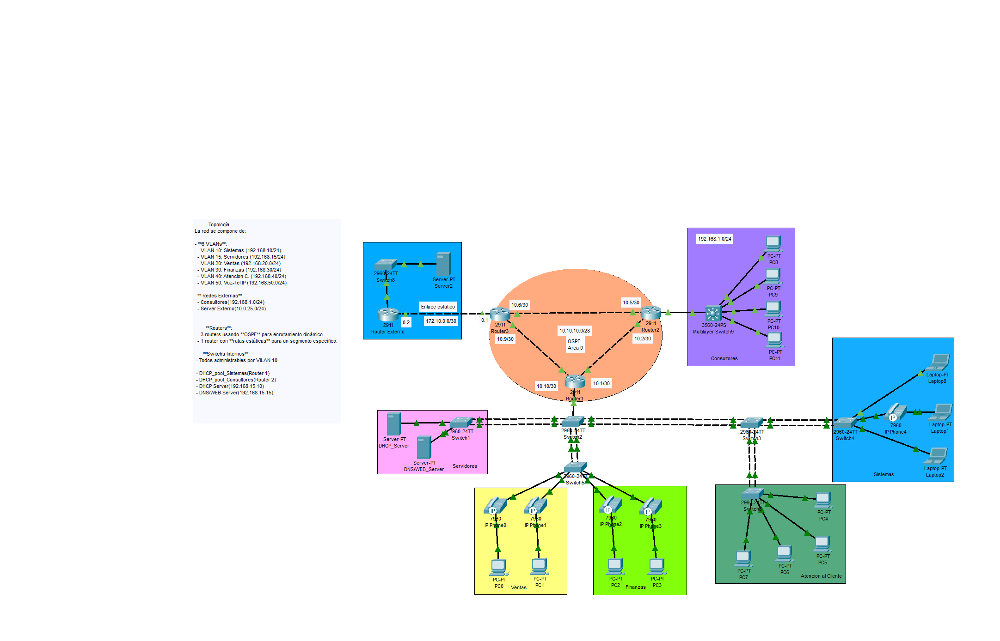

# 🏢 Laboratorio de Red Empresarial Avanzada - Cisco Packet Tracer

## 🔹 Descripción
Este laboratorio simula la infraestructura de red de una empresa mediana con múltiples departamentos, servidores internos y externos, además de servicios de voz sobre IP (VoIP).  
Se implementan **VLANs**, **OSPF selectivo**, **enrutamiento estático**, **DHCP**, **ACLs extendidas**, y **EtherChannel** para optimizar la conectividad, seguridad y redundancia.

---

## 🔹 Topología
📌 La red se compone de:  

- **6 VLANs internas**:  
  - VLAN 10: Sistemas (192.168.10.0/24)  
  - VLAN 15: Servidores (192.168.15.0/24)  
  - VLAN 20: Ventas (192.168.20.0/24)  
  - VLAN 30: Finanzas (192.168.30.0/24)  
  - VLAN 40: Atención C. (192.168.40.0/24)  
  - VLAN 50: Voz - Teléfonos IP (192.168.50.0/24)  

- **Redes externas**:  
  - Consultores (192.168.1.0/24)  
  - Servidor Externo (10.0.25.0/24)  

- **Routers**:  
  - 3 routers usando **OSPF** para enrutamiento dinámico (solo VLAN 10 y VLAN 20).  
  - 1 router con **rutas estáticas** para un segmento específico.  

- **Switches internos**:  
  - Todos administrables por la VLAN 10.  

- **Servicios de red**:  
  - DHCP_pool_Sistemas en Router 1.  
  - DHCP_pool_Consultores en Router 2.  
  - Servidor DHCP dedicado (192.168.15.10).  
  - Servidor DNS/WEB (192.168.15.15).  

---

## 🔹 Tecnologías Implementadas
- VLANs (datos y voz).  
- Trunking 802.1Q.  
- OSPF limitado.  
- Enrutamiento estático.  
- DHCP en router y servidor.  
- ACLs extendidas.  
- EtherChannel (PAgP).  
- VoIP con asignación dinámica de direcciones IP.  

---

## 🔹 Configuraciones Clave
1. **VLANs y Trunking**  
   - Creación de VLANs de datos y voz.  
   - Configuración de puertos en modo acceso (PC + Teléfono IP).  
   - Configuración de puertos troncales entre switches.  

2. **EtherChannel**  
   - Configuración de PAgP en enlaces redundantes entre switches.  

3. **Enrutamiento**  
   - OSPF configurado únicamente en VLAN 10 y VLAN 20.  
   - Rutas estáticas en un router adicional para conectividad controlada.  

4. **DHCP**  
   - Router 1 configurado como servidor DHCP para VLAN 10 (Sistemas).  
   - Router 2 configurado como servidor DHCP para Consultores.  
   - Servidor DHCP dedicado para VLAN 20, 30, 40 y 50.

5. **ACLs Extendidas**  
   - Permitir solo a VLAN 10 hacer ping a VLAN 15.  
   - Negar acceso desde VLAN 40 a la web de VLAN 15.  

---

## 🔹 Resultados de Pruebas
- ✅ Conectividad entre VLANs autorizadas.  
- ✅ Bloqueo de accesos no permitidos con ACLs.  
- ✅ PCs obtienen IP dinámica desde router o servidor DHCP.  
- ✅ Teléfonos IP obtienen IP desde VLAN de voz y permiten acceso de PC en mismo puerto.  
- ✅ OSPF operativo solo en VLANs especificas.  
- ✅ Rutas estáticas funcionando en paralelo.  
- ✅ EtherChannel operativo entre switches.  

---

## 🔹 Capturas

---

## 🔹 Archivos
- [topologia.pkt](Mylab.pkt) → Archivo de Packet Tracer.
- [configuraciones.txt](configuraciones.txt) → Archivo txt.
    
---

## 🔹 Futuras mejoras  
- Integrar servidor Syslog para centralizar logs.  
- Monitoreo con SNMP.  

---
👨‍💻 Autor: Juan R.

